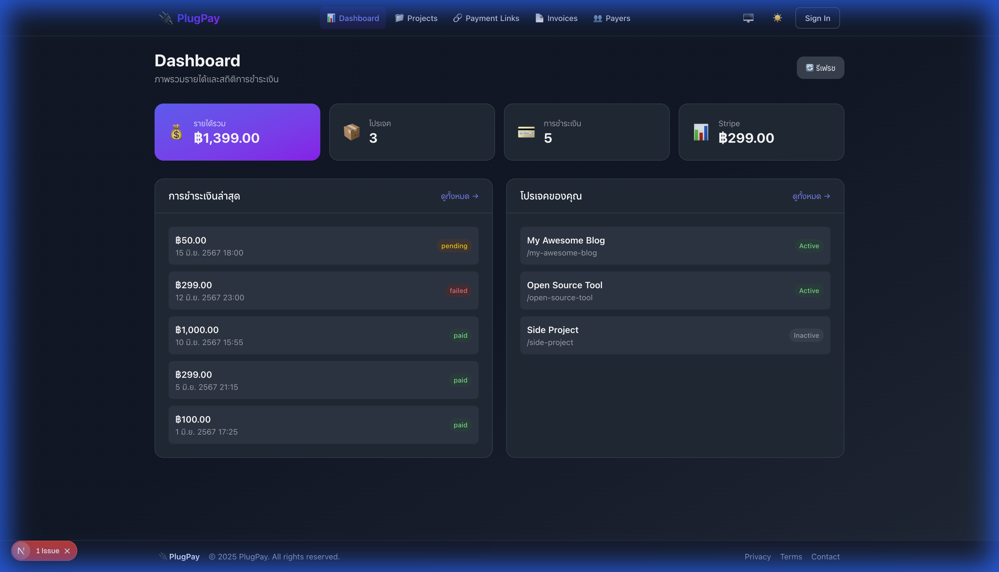
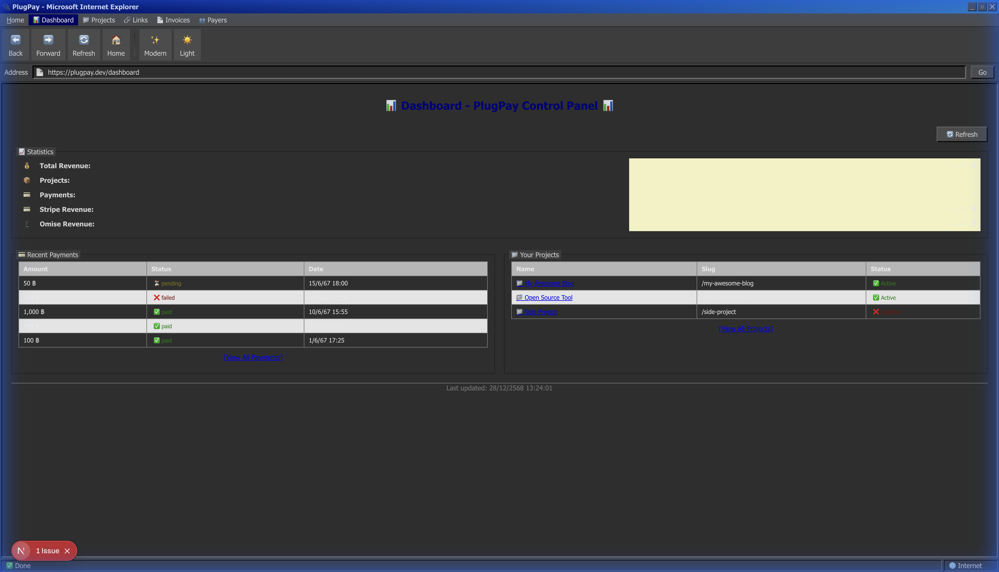

<div align="center">

# 🔌 PlugPay

### Modern Payment Link Platform with Retro Mode

[](https://nextjs.org/)
[](https://www.typescriptlang.org/)
[](https://tailwindcss.com/)
[](LICENSE)

[]()
[]()
[]()

**สร้าง Payment Links, Invoices และระบบรับชำระเงินอย่างง่ายดาย**

[Demo](#-demo) • [Features](#-features) • [Installation](#-installation) • [Tech Stack](#-tech-stack) • [Architecture](#-architecture)

</div>

---

## 📸 Screenshots

<table>
  <tr>
    <td align="center"><strong>🌙 Modern Dark Theme</strong></td>
    <td align="center"><strong>🖥️ Retro Windows 98 Mode</strong></td>
  </tr>
  <tr>
    <td></td>
    <td></td>
  </tr>
</table>

<details>
<summary>📷 More Screenshots</summary>

### Landing Page


</details>

---

## ✨ Features

### 🎨 Dual Layout System
- **Modern Layout** - Glassmorphism, gradients, dark/light mode
- **Retro Layout** - Windows 98 / IE5 aesthetic with working toolbar

### 💳 Payment Management
- 📊 **Dashboard** - Real-time stats, revenue overview
- 📁 **Projects** - Organize payment links by project
- 🔗 **Payment Links** - Create donate, fixed, and custom links
- 📄 **Invoices** - Generate and track invoices
- 👥 **Payers** - Customer management

### 🛠️ Developer Experience
- ⚡ Built with Next.js 16 App Router
- 🎯 Clean Architecture pattern
- 🔄 SSR with initial data hydration
- 📱 Fully responsive design

---

## 🚀 Installation

```bash
# Clone the repository
git clone https://github.com/yourusername/plugpay-nextjs.git

# Navigate to directory
cd plugpay-nextjs

# Install dependencies
yarn install

# Run development server
yarn dev
```

Open [http://localhost:3000](http://localhost:3000) in your browser.

---

## 🛠️ Tech Stack

| Category | Technology |
|----------|------------|
| **Framework** | Next.js 16 (App Router) |
| **Language** | TypeScript |
| **Styling** | TailwindCSS v4, CSS Modules |
| **State** | Zustand |
| **Animations** | React Spring |
| **Theme** | next-themes |
| **Database** | Supabase (Planned) |

---

## 📐 Architecture

```
src/
├── domain/           # Business entities & types
│   └── types/
├── data/             # Data layer
│   └── mock/         # Mock data for development
├── infrastructure/   # External services
│   └── repositories/ # Data access layer
│       └── mock/     # Mock repositories
└── presentation/     # UI layer
    ├── components/   # React components
    │   ├── main/     # Modern UI components
    │   ├── retro/    # Win98 style components
    │   ├── dashboard/
    │   ├── projects/
    │   └── ...
    ├── layouts/      # Layout components
    │   ├── MainLayout/
    │   └── RetroLayout/
    ├── presenters/   # Business logic
    └── stores/       # Zustand stores
```

### Design Patterns
- **Clean Architecture** - Separation of concerns
- **Presenter Pattern** - UI logic separated from components
- **Repository Pattern** - Data access abstraction

---

## 📁 Project Structure

```
plugpay-nextjs/
├── app/                    # Next.js App Router
│   ├── dashboard/
│   ├── projects/
│   ├── payment-links/
│   ├── invoices/
│   └── payers/
├── public/
│   └── styles/            # CSS files
├── src/                   # Source code
└── docs/
    └── screenshots/       # Documentation images
```

---

## 🎯 Roadmap

- [x] Layout System (Main + Retro)
- [x] Dashboard with stats
- [x] Projects CRUD
- [x] Payment Links management
- [x] Invoices management
- [x] Payers management
- [ ] Authentication (Supabase)
- [ ] Real payment integration
- [ ] Webhook management
- [ ] API documentation

---

## 📄 License

This project is licensed under the MIT License - see the [LICENSE](LICENSE) file for details.

---

<div align="center">

Made with ❤️ by [PlugPay Team](https://github.com/yourusername)

⭐ Star us on GitHub — it motivates us a lot!

</div>
